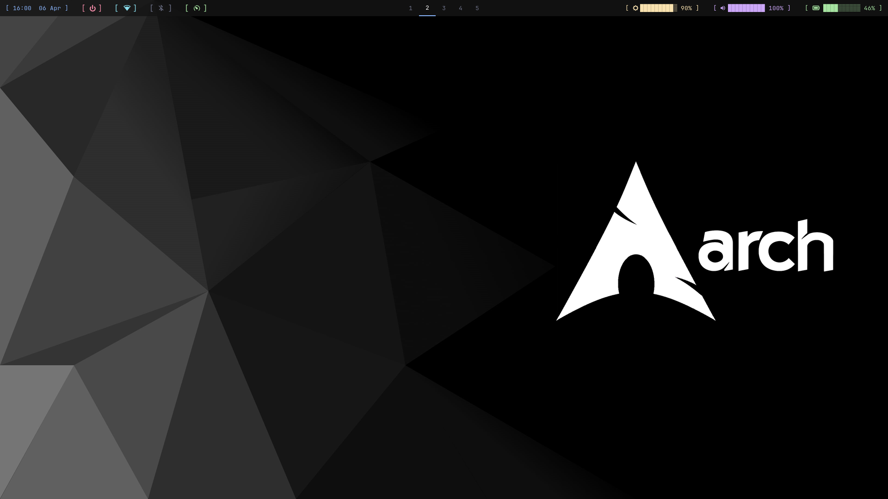
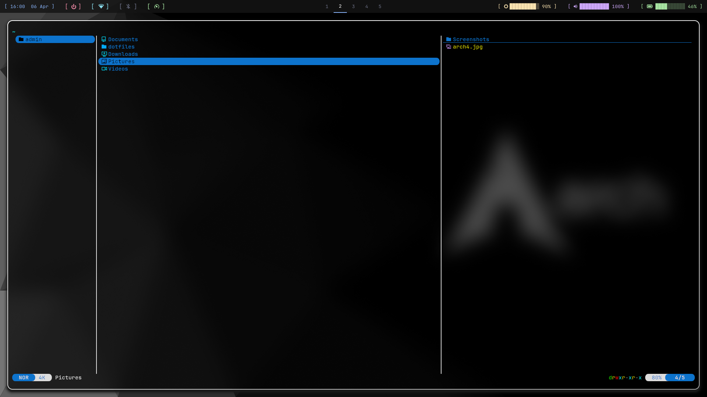
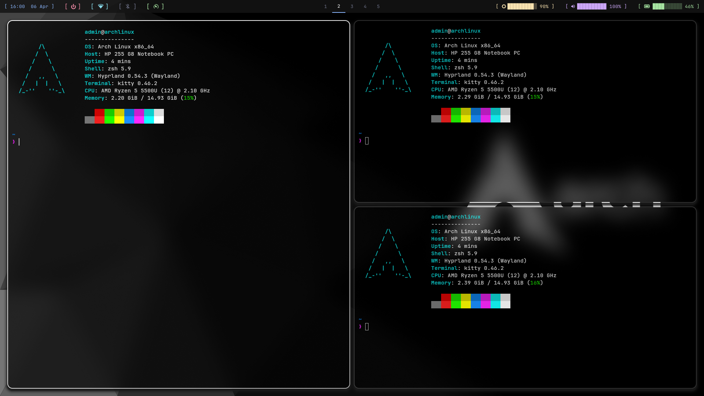

# Hyprland Dotfiles

My personal Arch Linux + Hyprland configuration.

# Preview




## Setup
- **OS**: Arch Linux
- **WM**: Hyprland
- **Terminal**: Kitty
- **Shell**: Zsh + Starship
- **Bar**: Waybar
- **File Manager**: Yazi
- **Wallpaper**: awww

## Install
Clone the repo and run the install script:
\```bash
git clone git@github.com:kyrdzik/hyprland_dotfiles.git ~/dotfiles
cd ~/dotfiles
chmod +x install.sh
./install.sh
\```

The install script will:
- Install all dependencies using pacman
- Copy all config files to the correct locations
- Set zsh as the default shell

## Keybindings
| Key | Action |
|-----|--------|
| SUPER + E | Open Yazi file manager |
| SUPER + B | Open Waybar |
| XF86MonBrightnessUp/Down | Brightness +/- 10% |
| XF86AudioRaiseVolume/LowerVolume | Volume +/- 5% |
| XF86AudioMute | Mute audio |
